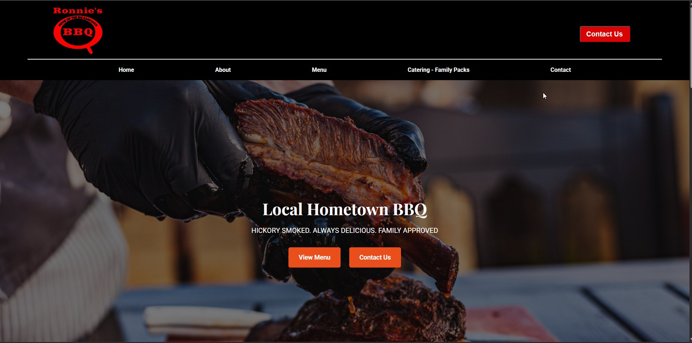

# Ronnie’s Q – Static HTML/CSS/JS Site

This project is a responsive static website for Ronnie’s Q BBQ Restaurant, built using HTML, CSS, and JavaScript. The site showcases a classic Southern BBQ restaurant, featuring a menu, contact options, and event catering details in a clean, user-friendly design.

## Table of contents

- [Overview](#overview)
  - [Screenshot](#screenshot)
  - [Links](#links)
- [My process](#my-process)
  - [Built with](#built-with)
  - [What I learned](#what-i-learned)
- [Author](#author)

## Overview
Ronnie’s Q is a static restaurant site designed to capture the warmth and tradition of a home-style BBQ spot. It highlights the menu, catering services, and locations, offering an intuitive user experience.

Key features include:

- Responsive design optimally structured for mobile, tablet, and desktop viewports

- Static layout with clear navigation across Home, About, Menu, Catering, and Contact sections

- Contact forms allowing users to message the restaurant or inquire about events

- Catering information and event planning call-outs with easy-to-use navigation

- Clean, semantic HTML and modular CSS to enhance readability and maintainability

- Cross-browser compatibility ensuring consistent behavior across devices

### Screenshot

### Links

- Live Site URL: [Ronnie's Q](https://lit-97.github.io/ronniesq/)

## My process
I began by laying out the site structure in HTML and organizing content sections intuitively, then:

1. Constructed responsive layouts using semantic HTML and modular CSS

2. Ensured clear and intuitive navigation via a fixed menu bar

3. Developed a contact form and event inquiry interface for catering options

4. Styled visual content with CSS, including consistent typography and visuals

5. Validated cross-browser compatibility and responsiveness

6. Published the site via GitHub Pages for easy access and sharing

### Built with

- HTML5 (Semantic structure & layout)

- CSS3 (Responsive design & styling)

- JavaScript (Interactive contact form)

- GitHub Pages (Hosting & deployment)

### Growth & Insights 🌱

- Building a clean, interactive static website without frameworks

- Crafting responsive layouts for multiple devices using CSS only

- Handling user contact via front-end forms

- Maintaining clean, modular code for readability and ease of updates

- Deploying a static site with GitHub Pages for a live, shareable presence

- Managing a production deployment on Vercel

## Author

- Website - [My Portfolio](https://lit-97.github.io/portfolio/)
- GitHub  - [@Lit-97](https://github.com/Lit-97)
